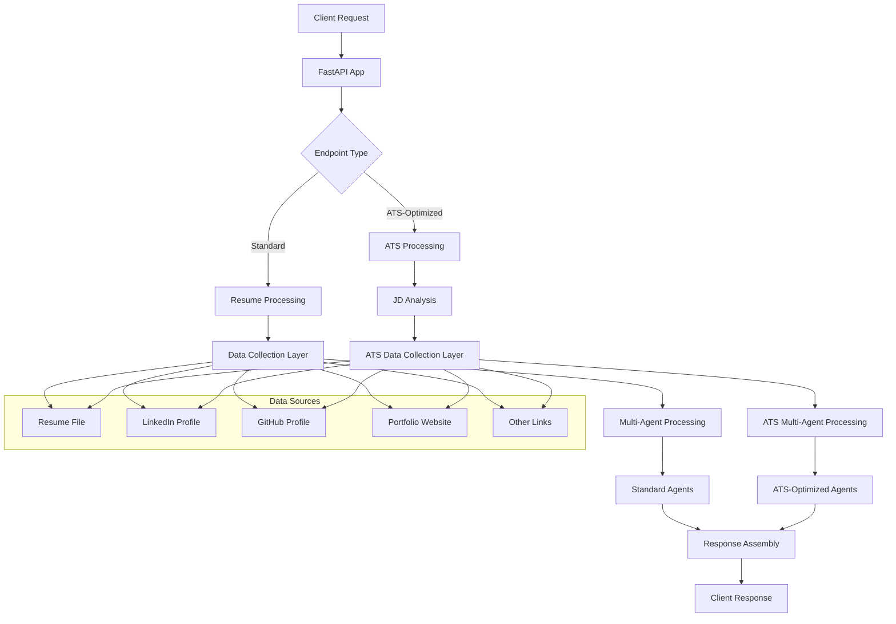

# 🚀 Resume Maker API - Intelligent Multi-Source Resume Analysis & ATS Optimization

[](https://fastapi.tiangolo.com)
[](https://python.org)
[](https://openai.com)
[](https://pydantic.dev)

> **Advanced AI-powered resume analysis system that aggregates data from multiple sources (Resume, LinkedIn, GitHub, Portfolio) and provides both comprehensive improvement analysis and ATS-optimized outputs tailored to specific job descriptions.**

## 📋 Table of Contents

- [🌟 Overview](#-overview)
- [✨ Key Features](#-key-features)
- [🏗️ Architecture](#️-architecture)
- [🔧 Technology Stack](#-technology-stack)
- [📦 Installation](#-installation)
- [🚀 Quick Start](#-quick-start)
- [📚 API Endpoints](#-api-endpoints)
- [🤖 AI Agent System](#-ai-agent-system)
- [🎯 ATS Optimization](#-ats-optimization)
- [📁 Project Structure](#-project-structure)
- [💡 Usage Examples](#-usage-examples)
- [🔒 Environment Variables](#-environment-variables)
- [🧪 Testing](#-testing)
- [🤝 Contributing](#-contributing)
- [📄 License](#-license)

## 🌟 Overview

Resume Maker API is a sophisticated, multi-agent AI system designed to revolutionize resume analysis and optimization. The application leverages advanced language models to process resumes alongside external data sources, providing comprehensive insights and ATS-optimized outputs.

### Key Capabilities

- **🔍 Multi-Source Data Aggregation**: Combines resume, LinkedIn, GitHub, and portfolio data
- **🤖 AI-Powered Analysis**: Uses GPT-4 for intelligent content extraction and optimization
- **🎯 ATS Optimization**: Tailors resumes for Applicant Tracking System compatibility
- **⚡ Concurrent Processing**: Parallel processing for optimal performance
- **📊 Comprehensive Output**: Structured data extraction across all resume sections

## ✨ Key Features

### 📄 **Comprehensive Resume Analysis**
- **Smart Parsing**: Extracts structured data from PDF, DOC, DOCX, and TXT files
- **Experience Calculation**: Automatically calculates total years of professional experience
- **Multi-Format Support**: Handles various resume formats and structures
- **Data Validation**: Cross-validates information across multiple sources

### 🔗 **Multi-Source Integration**
- **LinkedIn Integration**: Extracts professional profile data
- **GitHub Analysis**: Analyzes repositories, skills, and project contributions
- **Portfolio Scraping**: Processes portfolio websites for additional context
- **Cross-Validation**: Ensures data consistency across sources

### 🎯 **ATS Optimization Engine**
- **Job Description Analysis**: Extracts keywords, skills, and requirements
- **Strategic Alignment**: Aligns resume content with job requirements
- **Keyword Optimization**: Maximizes ATS compatibility scores
- **Role-Specific Tailoring**: Customizes content for target positions

### ⚡ **Performance & Scalability**
- **Concurrent Processing**: Parallel execution of multiple agents
- **Async Architecture**: Non-blocking I/O operations
- **Token Management**: Efficient OpenAI API usage tracking
- **Error Handling**: Robust error recovery and fallback mechanisms

## 🏗️ Architecture

The system follows a **multi-agent architecture** with specialized AI agents for different resume sections:



### 🔄 Processing Flow

1. **📤 Data Ingestion**: Upload resume and provide optional external links
2. **🔍 Multi-Source Collection**: Concurrent data gathering from all sources
3. **🤖 AI Agent Processing**: Specialized agents analyze different resume sections
4. **📊 Data Synthesis**: Intelligent merging and validation of extracted information
5. **📋 Response Generation**: Structured output with comprehensive analysis

## 🔧 Technology Stack

### **Backend Framework**
- **FastAPI**: Modern, fast web framework for building APIs
- **Pydantic**: Data validation using Python type annotations
- **Python 3.10+**: Core programming language

### **AI & Machine Learning**
- **OpenAI GPT-4**: Primary language model for analysis
- **Custom Prompt Engineering**: Specialized prompts for each domain
- **Structured Output**: JSON schema-based response formatting

### **Data Processing**
- **aiofiles**: Asynchronous file operations
- **BeautifulSoup4**: Web scraping and HTML parsing
- **pandas**: Data manipulation and analysis
- **PyPDF2/pdfminer**: PDF document processing

### **External Integrations**
- **LinkedIn Scraping**: Profile data extraction
- **GitHub API**: Repository and contribution analysis
- **Web Scraping**: Portfolio and website content extraction

### **Development & Deployment**
- **uvicorn**: ASGI server for production deployment
- **python-dotenv**: Environment variable management
- **CORS Middleware**: Cross-origin request support

## 📦 Installation

### Prerequisites
- Python 3.10 or higher
- OpenAI API key
- Git (for version control)

### Setup Instructions

1. **Clone the Repository**
   ```bash
   git clone https://github.com/yourusername/resume-maker-api.git
   cd resume-maker-api
   ```

2. **Create Virtual Environment**
   ```bash
   python -m venv env
   source env/bin/activate  # On Windows: env\Scripts\activate
   ```

3. **Install Dependencies**
   ```bash
   pip install -r requirements.txt
   ```

4. **Environment Configuration**
   ```bash
   cp .env.example .env
   # Edit .env with your configuration
   ```

5. **Verify Installation**
   ```bash
   python -c "import fastapi; print('FastAPI installed successfully')"
   ```

## 🚀 Quick Start

### 1. Configure Environment Variables

Create a `.env` file in the project root:

```env
OPENAI_API_KEY=your_openai_api_key_here
ENVIRONMENT=development
LOG_LEVEL=info
MAX_FILE_SIZE=10485760  # 10MB
ALLOWED_EXTENSIONS=.pdf,.doc,.docx,.txt
```

### 2. Launch the Application

```bash
# Development mode with auto-reload
uvicorn app:app --host 0.0.0.0 --port 8000 --reload

# Production mode
uvicorn app:app --host 0.0.0.0 --port 8000
```

### 3. Access the API

- **API Documentation**: http://localhost:8000/docs
- **Interactive API**: http://localhost:8000/redoc
- **Health Check**: http://localhost:8000/health

## 📚 API Endpoints

### 🏠 **Root & Health**

#### `GET /`
- **Description**: API information and available endpoints
- **Response**: Basic API metadata and endpoint list

#### `GET /health`
- **Description**: Health check endpoint
- **Response**: Service status and timestamp

### 📄 **Resume Processing**

#### `POST /improvement-resume`
**Standard resume analysis with multi-source enhancement**

**Request Parameters:**
- `resume_file` (required): Resume file (PDF, DOC, DOCX, TXT)
- `github_profile` (optional): GitHub profile URL
- `linkedin_profile` (optional): LinkedIn profile URL
- `portfolio_link` (optional): Portfolio website URL
- `other_link` (optional): Additional relevant link

**Response Structure:**
```json
{
  "status": "success",
  "message": "Comprehensive resume analysis completed successfully",
  "analysis_results": {
    "basic_information": { ... },
    "experience": { ... },
    "education": { ... },
    "skills": { ... },
    "projects": { ... },
    "certifications": { ... },
    "achievements": { ... },
    "languages": { ... }
  },
  "total_tokens_consumed": 1250
}
```

#### `POST /ATS-resume`
**ATS-optimized resume analysis with job description alignment**

**Request Parameters:**
- `resume_file` (required): Resume file (PDF, DOC, DOCX, TXT)
- `job_description` (required): Target job description
- `github_profile` (optional): GitHub profile URL
- `linkedin_profile` (optional): LinkedIn profile URL
- `portfolio_link` (optional): Portfolio website URL
- `other_link` (optional): Additional relevant link

**Response Structure:**
```json
{
  "status": "success",
  "message": "ATS-optimized resume analysis completed successfully",
  "analysis_results": {
    "basic_information": { ... },
    "experience": { ... },
    "education": { ... },
    "skills": { ... },
    "projects": { ... },
    "certifications": { ... },
    "achievements": { ... }
  },
  "total_tokens_consumed": 1850
}
```

## 🤖 AI Agent System

The application employs a sophisticated multi-agent architecture with specialized AI agents:

### 📊 **Standard Agents** (`/improvement-resume`)

| Agent | Purpose | Data Sources |
|-------|---------|--------------|
| **Basic Information** | Extract name, contact, summary | Resume, LinkedIn |
| **Experience** | Work history and descriptions | Resume, LinkedIn, GitHub |
| **Education** | Academic background | Resume, LinkedIn, Portfolio |
| **Skills** | Technical and soft skills | Resume, GitHub, Portfolio |
| **Projects** | Project portfolio | Resume, LinkedIn, GitHub |
| **Certifications** | Professional certifications | Resume, LinkedIn, Portfolio |
| **Achievements** | Awards and recognitions | Resume, LinkedIn, Portfolio |
| **Languages** | Language proficiencies | Resume, LinkedIn, Portfolio |

### 🎯 **ATS-Optimized Agents** (`/ATS-resume`)

| Agent | Purpose | JD Input Parameters |
|-------|---------|-------------------|
| **ATS Basic Information** | Role-aligned summary | `job_title` |
| **ATS Experience** | Keyword-optimized descriptions | `hard_skills`, `tools_and_technologies`, `responsibilities`, `action_verbs` |
| **ATS Education** | Qualification-aligned education | `required_qualifications` |
| **ATS Skills** | JD-prioritized skills | `hard_skills`, `soft_skills`, `tools_and_technologies` |
| **ATS Projects** | Technology-aligned projects | `hard_skills`, `tools_and_technologies`, `preferred_qualifications` |
| **ATS Certifications** | Requirement-matched certs | `preferred_qualifications`, `required_qualifications` |
| **ATS Achievements** | Soft skill-focused achievements | `soft_skills`, `action_verbs` |

### 🧠 **Job Description Agent**

Analyzes job postings to extract:
- **Job Title**: Official position title
- **Hard Skills**: Technical competencies
- **Soft Skills**: Interpersonal abilities
- **Tools & Technologies**: Required software/platforms
- **Responsibilities**: Core job duties
- **Required Qualifications**: Must-have requirements
- **Preferred Qualifications**: Nice-to-have qualifications
- **Action Verbs**: Performance-oriented language

## 🎯 ATS Optimization

### 🔍 **How ATS Optimization Works**

1. **📋 Job Description Analysis**: Extract keywords, skills, and requirements
2. **🎯 Strategic Alignment**: Map candidate data to job requirements
3. **📊 Keyword Integration**: Naturally incorporate JD terminology
4. **⚖️ Priority Ranking**: Emphasize JD-relevant content first
5. **✅ Quality Assurance**: Maintain authenticity while optimizing

### 🏆 **Optimization Benefits**

- **📈 Higher ATS Scores**: Improved keyword matching
- **🔍 Better Visibility**: Enhanced recruiter discoverability
- **🎯 Targeted Content**: Role-specific optimization
- **⚡ Faster Processing**: Automated alignment process
- **📊 Data-Driven**: Evidence-based keyword integration

### 📋 **ATS Strategy Examples**

**Before Optimization:**
```
"Developed web applications using modern frameworks"
```

**After ATS Optimization (for React Developer role):**
```
"Developed responsive web applications using React.js and Node.js, implementing Redux for state management and integrating RESTful APIs to deliver scalable solutions"
```

## 📁 Project Structure

```
Resume_Maker/
├── 📱 app.py                     # FastAPI application and endpoints
├── ⚙️ processing.py              # Standard resume processing logic
├── 🎯 ats_processing.py          # ATS-optimized processing logic
├── 🔧 shared_client.py           # OpenAI client configuration
├── 📋 requirements.txt           # Python dependencies
├── 🌍 .env                       # Environment variables
├── 📖 README.md                  # Project documentation
│
├── 🤖 Agent/                     # Core AI agents
│   ├── resume_agent.py           # Resume parsing agent
│   ├── github_agent.py           # GitHub analysis agent
│   ├── protflow_agent.py         # Portfolio analysis agent
│   └── jd_agent.py              # Job description analysis agent
│
├── 🎯 Atsagent/                  # ATS-optimized agents
│   ├── Ats_basic_Information_agent.py
│   ├── Ats_experience_agent.py
│   ├── Ats_education_agent.py
│   ├── Ats_skills_agent.py
│   ├── Ats_projects_agent.py
│   ├── Ats_certifications_agent.py
│   └── Ats_achievements_agent.py
│
├── 🎭 Multiagent/                # Standard analysis agents
│   ├── Basic_Information_agent.py
│   ├── Experience_agent.py
│   ├── Education_agent.py
│   ├── Skills_agent.py
│   ├── Projects_agent.py
│   ├── Certifications_agent.py
│   ├── Achievements_agent.py
│   └── Languages_agent.py
│
├── 🕷️ Scraper/                   # Data collection modules
│   ├── resume_scraper.py         # Resume file processing
│   ├── linkedin_scraper.py       # LinkedIn data extraction
│   ├── github_scraper.py         # GitHub API integration
│   └── protflow_other_link.py    # Website content scraping
│
├── 📁 uploads/                   # Temporary file storage
└── 🗃️ env/                       # Python virtual environment
```

## 💡 Usage Examples

### 📝 **Basic Resume Analysis**

```bash
curl -X POST "http://localhost:8000/improvement-resume" \
  -F "resume_file=@candidate_resume.pdf" \
  -F "github_profile=https://github.com/candidate" \
  -F "linkedin_profile=https://linkedin.com/in/candidate"
```

### 🎯 **ATS-Optimized Analysis**

```bash
curl -X POST "http://localhost:8000/ATS-resume" \
  -F "resume_file=@candidate_resume.pdf" \
  -F "job_description=Software Engineer position requiring Python, React, AWS experience..." \
  -F "github_profile=https://github.com/candidate" \
  -F "linkedin_profile=https://linkedin.com/in/candidate"
```

### 🐍 **Python Integration**

```python
import requests
import json

# ATS-optimized analysis
url = "http://localhost:8000/ATS-resume"
files = {"resume_file": open("resume.pdf", "rb")}
data = {
    "job_description": "Senior Python Developer role requiring Django, PostgreSQL...",
    "github_profile": "https://github.com/candidate",
    "linkedin_profile": "https://linkedin.com/in/candidate"
}

response = requests.post(url, files=files, data=data)
result = response.json()

# Process the optimized resume data
if result["status"] == "success":
    analysis = result["analysis_results"]
    print(f"Optimized resume generated with {result['total_tokens_consumed']} tokens")
```

### 📊 **Response Data Structure**

```python
# Example response structure
{
    "status": "success",
    "message": "ATS-optimized resume analysis completed successfully",
    "analysis_results": {
        "basic_information": {
            "CandidateFullName": "John Doe",
            "EmailAddress": "john@example.com",
            "PhoneNumber": "+1-234-567-8900",
            "ProfessionalTitle": "Senior Software Engineer",
            "Summary": "I am a Senior Software Engineer with 5 years of experience...",
            "SuggestedRole": "Lead Python Developer",
            "YearsOfExperienceRequired": "5.2 years"
        },
        "experience": [
            {
                "CompanyName": "Tech Corp",
                "Position": "Software Engineer",
                "Duration": {"StartDate": "Jan 2020", "EndDate": "Present"},
                "Location": "San Francisco, CA",
                "Description": "Developed scalable Python applications using Django...",
                "SkillSet": ["Python", "Django", "PostgreSQL", "AWS"]
            }
        ],
        "skills": [
            {
                "Skill_Category": "Programming Languages (JD Priority)",
                "Skills": ["Python", "JavaScript", "Java", "TypeScript"]
            }
        ]
    },
    "total_tokens_consumed": 1850
}
```

## 🔒 Environment Variables

Create a `.env` file with the following configuration:

```env
# OpenAI Configuration
OPENAI_API_KEY=your_openai_api_key_here
OPENAI_MODEL=gpt-4o-mini

# Application Settings
ENVIRONMENT=development
DEBUG=true
LOG_LEVEL=info

# File Upload Settings
MAX_FILE_SIZE=10485760  # 10MB in bytes
ALLOWED_EXTENSIONS=.pdf,.doc,.docx,.txt
UPLOAD_DIR=uploads

# API Configuration
HOST=0.0.0.0
PORT=8000
RELOAD=true

# CORS Settings
CORS_ORIGINS=["*"]  # Restrict in production
CORS_METHODS=["GET", "POST", "PUT", "DELETE"]
CORS_HEADERS=["*"]

# Security (Add in production)
SECRET_KEY=your_secret_key_here
ACCESS_TOKEN_EXPIRE_MINUTES=30
```

## 🧪 Testing

### 🚀 **Running Tests**

```bash
# Install test dependencies
pip install pytest pytest-asyncio httpx

# Run all tests
pytest

# Run with coverage
pytest --cov=app

# Run specific test file
pytest tests/test_agents.py
```

### 📝 **Test Categories**

- **Unit Tests**: Individual agent functionality
- **Integration Tests**: Multi-agent workflows
- **API Tests**: Endpoint validation
- **Performance Tests**: Token usage and response times

### 🔍 **Example Test**

```python
import pytest
from fastapi.testclient import TestClient
from app import app

client = TestClient(app)

def test_health_endpoint():
    response = client.get("/health")
    assert response.status_code == 200
    assert response.json()["status"] == "healthy"

@pytest.mark.asyncio
async def test_resume_analysis():
    # Test resume analysis endpoint
    files = {"resume_file": ("test.pdf", b"fake pdf content", "application/pdf")}
    response = client.post("/improvement-resume", files=files)
    assert response.status_code == 200
```

## 🔧 **Performance Considerations**

### ⚡ **Optimization Features**
- **Concurrent Processing**: Parallel agent execution
- **Async I/O**: Non-blocking file operations
- **Token Management**: Efficient API usage tracking
- **Caching**: Reduce redundant API calls
- **Error Recovery**: Graceful failure handling

### 📊 **Monitoring Metrics**
- **Response Times**: API endpoint performance
- **Token Consumption**: OpenAI API usage
- **Success Rates**: Analysis completion rates
- **Error Tracking**: Failure pattern analysis

## 🤝 Contributing

### 🛠️ **Development Workflow**

1. **Fork the Repository**
   ```bash
   git fork https://github.com/yourusername/resume-maker-api.git
   ```

2. **Create Feature Branch**
   ```bash
   git checkout -b feature/your-feature-name
   ```

3. **Development Setup**
   ```bash
   pip install -r requirements-dev.txt
   pre-commit install
   ```

4. **Make Changes**
   - Follow existing code patterns
   - Add comprehensive tests
   - Update documentation

5. **Submit Pull Request**
   - Ensure all tests pass
   - Include detailed description
   - Reference related issues

### 📋 **Contribution Guidelines**

- **Code Quality**: Follow PEP 8 standards
- **Testing**: Maintain test coverage > 80%
- **Documentation**: Update relevant docs
- **Performance**: Consider token usage impact
- **Security**: Validate all inputs

## 📈 **Roadmap**

### 🎯 **Upcoming Features**
- [ ] **Multi-language Support**: Resumes in different languages
- [ ] **Industry Templates**: Specialized resume formats
- [ ] **Real-time Collaboration**: Shared editing capabilities
- [ ] **Analytics Dashboard**: Usage metrics and insights
- [ ] **API Rate Limiting**: Enhanced security controls
- [ ] **Resume Versioning**: Track optimization history
- [ ] **Batch Processing**: Multiple resume analysis

### 🔧 **Technical Improvements**
- [ ] **Caching Layer**: Redis integration for performance
- [ ] **Database Integration**: Persistent storage options
- [ ] **Kubernetes Deployment**: Container orchestration
- [ ] **Monitoring Stack**: Prometheus + Grafana
- [ ] **Load Balancing**: High availability setup

## 📄 License

This project is licensed under the MIT License - see the [LICENSE](LICENSE) file for details.

## 📞 Support

### 🆘 **Getting Help**
- **Documentation**: Check this README and API docs
- **Issues**: Report bugs via GitHub Issues
- **Discussions**: Community support in GitHub Discussions
- **Email**: Contact support@resumemaker.dev

### 🐛 **Common Issues**

**OpenAI API Errors**
```bash
# Check API key configuration
echo $OPENAI_API_KEY

# Verify API access
curl -H "Authorization: Bearer $OPENAI_API_KEY" \
  https://api.openai.com/v1/models
```

**File Upload Issues**
```bash
# Check file size and format
ls -lh uploads/
file uploads/resume.pdf
```

**Performance Issues**
```bash
# Monitor token usage
grep "total_tokens" logs/app.log

# Check concurrent processing
ps aux | grep uvicorn
```

---

<div align="center">

### 🌟 **Built with ❤️ using FastAPI, OpenAI, and Python**

**[⭐ Star this repository](https://github.com/yourusername/resume-maker-api)** if you find it useful!

</div>
